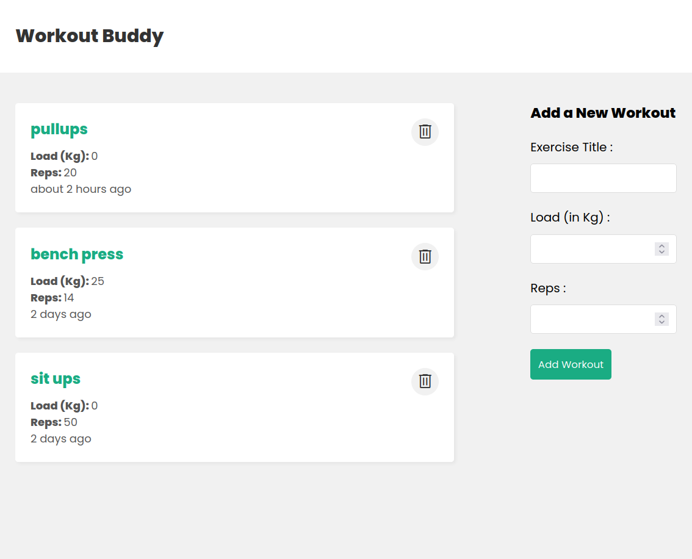

# Exercise Tracker

A fullstack application to track your exercises.

TODO: User authentication



## Setup
### Backend
```bash
cd backend
npm i

# create a file named .env with variables
# PORT=4000
# MONGO_URI=mongodb+srv://<username>:<password>@mongourl

npm run dev
```
## Frontend

```bash
cd frontend
npm i
npm run dev
```

You can now reach the website at http://localhost:5173